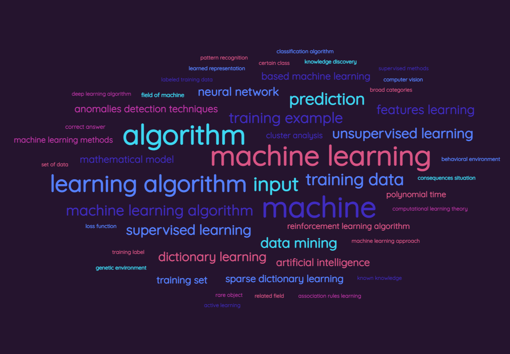
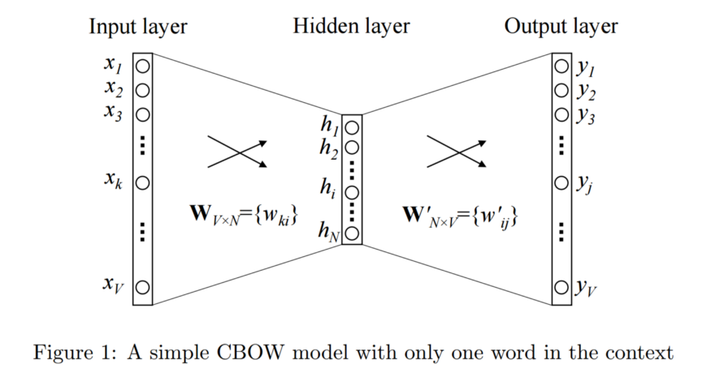
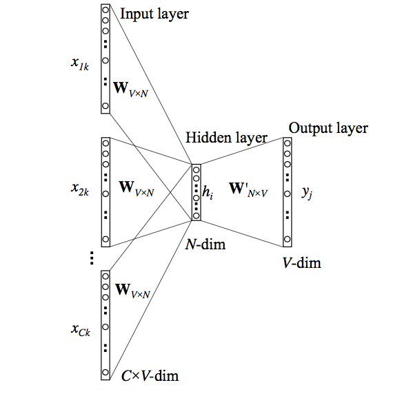
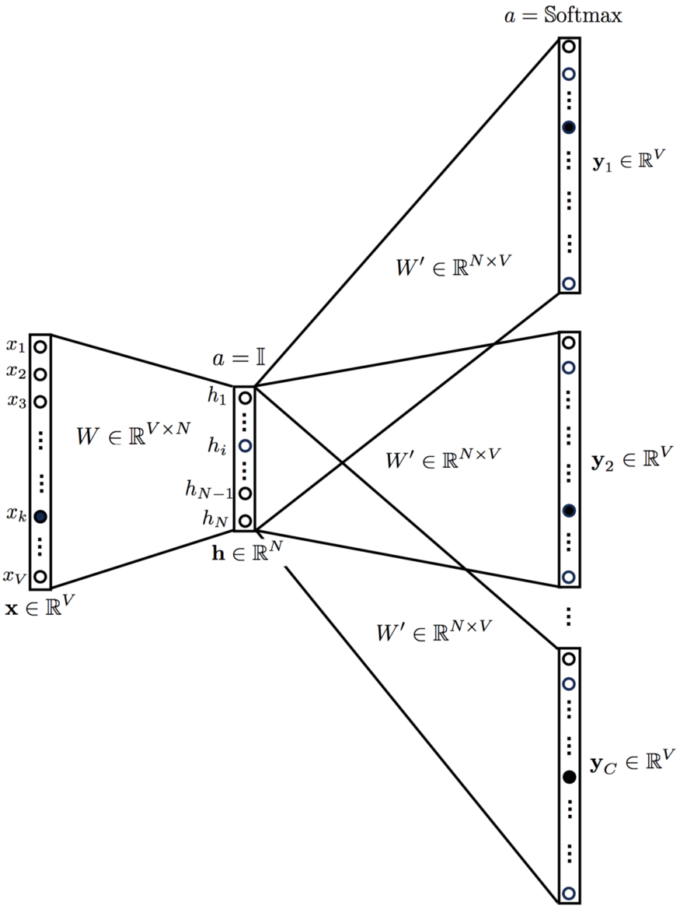
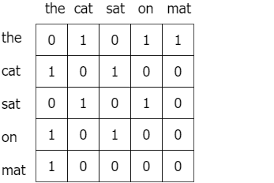
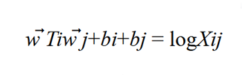
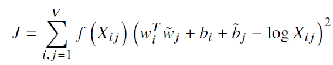
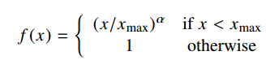

# Implementation of Word2Vec and GloVe

 

## Project Overview

Word embeddings are, in fact, a class of techniques where individual words are represented as real-valued vectors in a predefined vector space. Each word is mapped to one vector, and the vector values are learned in a way that resembles a neural network, and hence the technique is often lumped into the field of deep learning.
  
The key to the approach is the idea of using a densely distributed representation for each word.
  
Each word is represented by a real-valued vector, often tens or hundreds of dimensions. This is contrasted to the thousands or millions of dimensions required for sparse word representations, such as a one-hot encoding.
  
Word2Vec and GloVe are some of the most popular techniques to learn about word embeddings. In this project, we are going to build word2vec and GloVe algorithms from scratch using NumPy.

## Dataset

Webscraped https://en.wikipedia.org/wiki/Main_Page using selenium BeautifulSoup.

## Word2Vec

Word2Vec can be obtained using two methods:

1. Skip Gram
2. Common Bag Of Words (CBOW)
 

### CBOW Model

This method takes each word's context as the input and tries to predict the word corresponding to the context.
 
Consider our example: "Have a great day."
 
Let the input to the Neural Network be the word, "great". Notice that here we are trying to predict a target word "day" using a single context input word "great". More specifically, we use the one-hot encoding of the input word and measure the output error compared to the one-hot encoding of the target word "day". In the process of predicting the target word, we learn the vector representation of the target word.

 

 

The input or the context word is a one-hot encoded vector of size V. The hidden layer contains N neurons, and the output is again a V length vector with the elements being the softmax values.
 
Let’s get the terms in the picture right:
- WV x N is the weight matrix that maps the input X to the hidden layer.
- W'N x V is the weight matrix that maps the hidden layer outputs to the final output layer.

The hidden layer neurons just copy the weighted sum of inputs to the next layer. There is no activation like sigmoid, tanh or ReLU. The only non-linearity is the softmax calculations in the output layer.
 
However, the above model used a single context word to predict the target. We can use multiple context words to do the same.
 

 
The above model takes C context words. WV x N is used to calculate hidden layer inputs, we take an average over all these C context word inputs.

### Skip Gram Model
 

 
This looks like multiple-context CBOW model just got flipped. To some extent that is true.
We input the target word into the network. The model outputs C probability distributions. For each context position, we get C probability distributions of V probabilities, one for each word.
 

## GloVe Model
GloVe method is built on an important idea,
> You can derive semantic relationships between words from the co-occurrence matrix.
 

Given a corpus having V words, the co-occurrence matrix X will be a V x V matrix, where ith row and jth column of X, X_ij denotes how many times word i has co-occurred with word j.
 
An example co-occurrence matrix might look as follows.
 

 
The relationship of these words can be revealed by studying the ratio of their co-occurrence probabilities with various probe words, k. Let P(k | w) be the probability that the word k appears in the context of word w: ice co-occurs more frequently with solid than it does with gas, whereas steam co-occurs more frequently with gas than it does with solid. Both words co-occur frequently with water (as it is their shared property) and infrequently — with the unrelated word fashion. 
In other words, P(solid | ice) will be relatively high, and P(solid | steam) will be relatively low. Therefore, the ratio of P(solid | ice) / P(solid | steam) will be large. If we take a word such as gas that is related to steam but not to ice, the ratio of P(gas | ice) / P(gas | steam) will instead be small. For a word related to both ice and steam, such as water we expect the ratio to be close to one.
 
The way GloVe predicts surrounding words is by maximizing the probability of a context word occurring given a center word by performing a dynamic logistic regression.
 
Before training the actual model, a co-occurrence matrix X is constructed, where a cell Xij is a “strength” which represents how often the word i appears in the context of the word j. Once X is ready, it is necessary to decide vector values in continuous space for each word in the corpus, in other words, to build word vectors that show how every pair of words i and j co-occur.
 
We will produce vectors with a soft constraint that for each word pair of word i and word j
 

 
where bi and bj are scalar bias terms associated with words i and j, respectively.
 
We’ll do this by minimizing an objective function J, which evaluates the sum of all squared errors based on the above equation, weighted with a function f:
 

 
where V is the size of the vocabulary.
 
Yet, some co-occurrences that happen rarely or never are noisy and carry less information than the more frequent ones. To deal with them, a weighted least squares regression model is used. One class of weighting functions found to work well can be parameterized as
 

 
The model generates two sets of word vectors,W and W̃. When X is symmetric,W and W̃ are equivalent and differ only as a result of their random initializations; the two sets of vectors should perform equivalently. As for certain types of neural networks, training multiple instances of the network and then combining the results can help reduce overfitting and noise (Ciresan et al., 2012), W and W̃ are summed up as word vectors.

## References
1. Pennington, Jeffrey & Socher, Richard & Manning, Christopher. (2014). Glove: Global Vectors for Word Representation. EMNLP. 14. 1532-1543. 10.3115/v1/D14-1162.
2. Mikolov, T., Chen, K., Corrado, G., &amp; Dean, J. (2013, September 07). Efficient estimation of word representations in vector space. Retrieved March 27, 2021, from https://arxiv.org/abs/1301.3781v3
